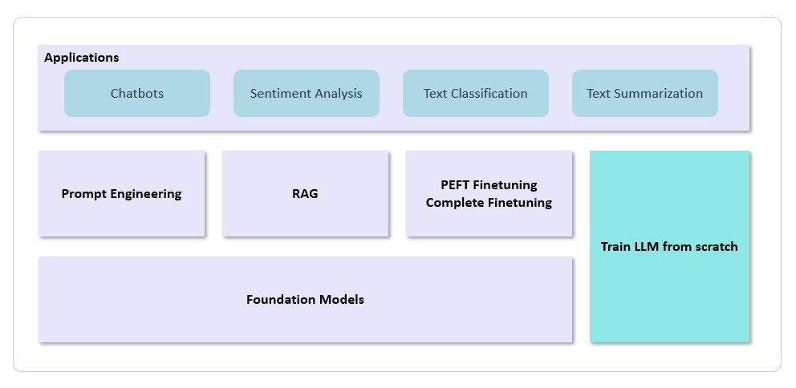
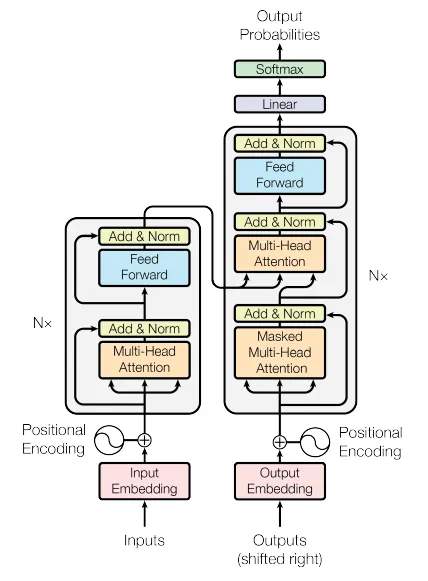
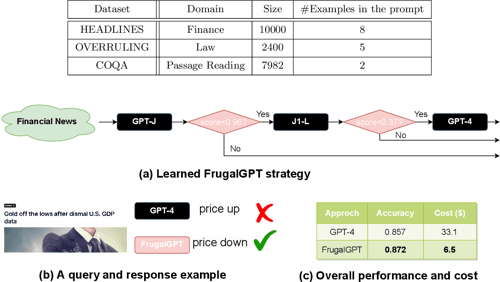

# GenAI Research Papers & Notes
This repository meticulously compiles a curated collection of seminal papers and resources in the field of generative AI. It encompasses a comprehensive range of topics including, but not limited to, Transformers, Foundation Models, Fine-tuning Techniques, Prompting Strategies, Efficient GPT Variants, Robust AI (RAI) Practices, Large Language Model Operational Scaling (LLMOPS), and Frugal AI Implementations.

Our aim is to provide a valuable resource for researchers, practitioners, and enthusiasts alike, facilitating ease of access to groundbreaking work and innovative advancements in the realm of generative AI. Each paper has been selected for its relevance and contribution to the field, ensuring that users can trust the quality and significance of the material presented.

We encourage exploration, discussion, and collaboration, and we welcome contributions and suggestions from the community to further enrich this repository. Dive in to discover a wealth of knowledge, inspire innovative ideas, and potentially contribute to the next wave of AI advancements!

  1. Foundation of GenAI

***
**1.1 Attention Is All You Need**

**Abstract**

<small>The dominant sequence transduction models are based on complex recurrent or convolutional neural networks in an encoder-decoder configuration. The best performing models also connect the encoder and decoder through an attention mechanism. We propose a new simple network architecture, the Transformer, based solely on attention mechanisms, dispensing with recurrence and convolutions entirely. Experiments on two machine translation tasks show these models to be superior in quality while being more parallelism and requiring significantly less time to train. Our model achieves 28.4 BLEU on the WMT 2014 English-to-German translation task, improving over the existing best results, including ensembles by over 2 BLEU. On the WMT 2014 English-to-French translation task, our model establishes a new single-model state-of-the-art BLEU score of 41.8 after training for 3.5 days on eight GPUs, a small fraction of the training costs of the best models from the literature. We show that the Transformer generalizes well to other tasks by applying it successfully to English constituency parsing both with large and limited training data.</small>

https://arxiv.org/pdf/1706.03762.pdf

<small>We can observe there is an encoder model on the left side and the decoder on the right one. Both contains a core block of “an attention and a feed-forward network” repeated N times. Important concept is self-attention mechanism here at the core.</small>

  2. Foundation Models

***
> **2.1 GPT1**

> **2.2 GPT2**

> **2.3 GPT3**

> **2.4 GPT4**

> **2.5 LLAMA2**

> **2.6 BLOOM**

> **2.7 PALM2**

  3. Finetuning

***
**1.1 LLAMA2**

  4. Prompt Engineering

***
**1.1 LLAMA2**

  5.  Frugal AI

***
> **5.1 FrugalGPT: How to Use Large Language Models While Reducing Cost and Improving Performance**

<small><small>Lingjiao Chen, Matei Zaharia, James Zou</small></small>

**Abstract**

<small>There is a rapidly growing number of large language models (LLMs) that users can query for a fee. We review the cost associated with querying popular LLM APIs, e.g. GPT-4, ChatGPT, J1-Jumbo, and find that these models have heterogeneous pricing structures, with fees that can differ by two orders of magnitude. In particular, using LLMs on large collections of queries and text can be expensive. Motivated by this, we outline and discuss three types of strategies that users can exploit to reduce the inference cost associated with using LLMs: 1) prompt adaptation, 2) LLM approximation, and 3) LLM cascade. As an example, we propose FrugalGPT, a simple yet flexible instantiation of LLM cascade which learns which combinations of LLMs to use for different queries in order to reduce cost and improve accuracy. Our experiments show that FrugalGPT can match the performance of the best individual LLM (e.g. GPT-4) with up to 98% cost reduction or improve the accuracy over GPT-4 by 4% with the same cost. The ideas and findings presented here lay a foundation for using LLMs sustainably and efficiently.</small>

https://arxiv.org/pdf/2305.05176.pdf

<small> <u>FROM PAPER</u> - Researchers vision over here is reducing LLM cost while improving accuracy. (a) The standard usage sends queries to a single LLM (e.g. GPT-4), which can be expensive. (b) Our proposal is to use prompt adaption, LLM approximation and LLM cascade to reduce the inference cost. By optimizing over the selection of different LLM APIs (e.g., GPT-J, ChatGPT, and GPT-4) as well as prompting strategies
(such as zero-shot [BMR+20], few-shot [LSZ+21], and chain-of-thought(CoT) [WWS+22]), we can
achieve substantial efficiency gains. (c) On HEADLINES (a financial news dataset), FrugalGPT can
reduce the inference cost by 98% while exceeding the performance of the best individual LLM (GPT-4).</small>

 <small>A case study of FrugalGPT on the HEADLINES dataset. (a) The cascade strategy that</small>
<small>FrugalGPT learned on this dataset with overall budget $6.5, one fifth of GPT-4’s cost. FrugalGPT</small>
<small>avoids querying GPT-4 as long as GPT-J and J1-L produce high-quality answers. (b) Sometimes</small>
<small>GPT-4 makes a mistake, but FrugalGPT learns to use the correct answers by J-1 and GPT-J. (c)</small>
<small>Overall, we observe that FrugalGPT reduces the cost by 80%, while improves the accuracy by 1.5%</small>
<small>compared to GPT-4.</small>

  6.  LLM OPS

***
**1.1 LLAMA2**

  7.  Responsible AI (RAI)

***
**7.1 The Foundation Model Transparency Index**

*A comprehensive assessment of the transparency of foundation model developers*

Foundation models have rapidly permeated society, catalyzing a wave of generative AI applications spanning enterprise and consumer-facing contexts. While the societal impact of foundation models is growing, transparency is on the decline, mirroring the opacity that has plagued past digital technologies (e.g. social media). Reversing this trend is essential: transparency is a vital precondition for public accountability, scientific innovation, and effective governance. To assess the transparency of the foundation model ecosystem and help improve transparency over time, we introduce the Foundation Model Transparency Index. The Foundation Model Transparency Index specifies 100 fine-grained indicators that comprehensively codify transparency for foundation models, spanning the upstream resources used to build a foundation model (e.g data, labor, compute), details about the model itself (e.g. size, capabilities, risks), and the downstream use (e.g. distribution channels, usage policies, affected geographies). We score 10 major foundation model developers (e.g. OpenAI, Google, Meta) against the 100 indicators to assess their transparency. To facilitate and standardize assessment, we score developers in relation to their practices for their flagship foundation model (e.g. GPT-4 for OpenAI, PaLM 2 for Google, Llama 2 for Meta). We present 10 top-level findings about the foundation model ecosystem: for example, no developer currently discloses significant information about the downstream impact of its flagship model, such as the number of users, affected market sectors, or how users can seek redress for harm. Overall, the Foundation Model Transparency Index establishes the level of transparency today to drive progress on foundation model governance via industry standards and regulatory intervention.

https://arxiv.org/pdf/2310.12941.pdf

Indicators
We define 100 indicators that comprehensively characterize transparency for foundation model developers. We divide our indicators into three broad domains:

Upstream. The upstream indicators specify the ingredients and processes involved in building a foundation model, such as the computational resources, data, and labor used to build foundation models. Full list of upstream indicators.
Model. The model indicators specify the properties and function of the foundation model, such as the model's architecture, capabilities, and risks Full list of model indicators.
Downstream. The downstream indicators specify how the foundation model is distributed and used, such as the the model's impact on users, any updates to the model, and the policies that govern its use. Full list of downstream indicators.

